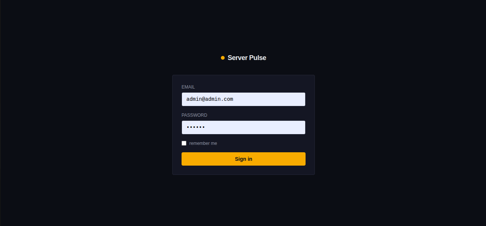
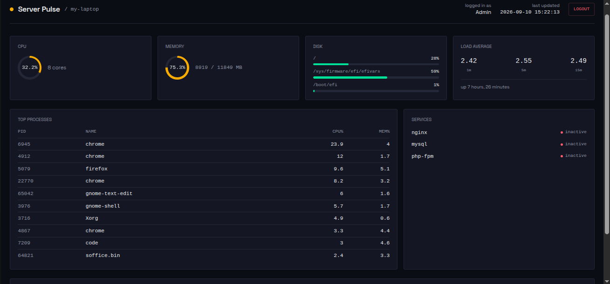

# Server Pulse

A real-time Linux server monitoring dashboard built with **Laravel** and **Livewire** — combining application development with hands-on Linux system administration.

Unlike generic monitoring tools, Server Pulse reads live system data directly from the host (via shell commands like `ps`, `df`, `free`, `systemctl`), stores historical metrics in a database, and automatically opens/resolves **incidents** when resource usage crosses configurable thresholds — with email and Telegram alerts.




---

## Why this project

Most portfolio projects show either "I can build a web app" or "I know Linux" — rarely both. Server Pulse is meant to demonstrate that a Laravel application and the Linux server it runs on aren't separate concerns: the app itself reads and reasons about real system state.

## Features

- **Live dashboard** — CPU, memory, disk, load average, top processes, and service status, auto-refreshing every few seconds
- **Historical tracking** — metrics recorded to the database every minute via Laravel's scheduler, not just held in memory
- **Automatic incident detection** — when a metric exceeds a configured threshold, an incident opens; when it returns to normal, the incident auto-resolves
- **Alerts** — email and Telegram notifications sent on incident open/resolve
- **Authentication** — the dashboard is protected behind a login screen (session-based, no public registration)
- **Zero external monitoring dependencies** — no Zabbix/Prometheus agent required; everything runs through native Linux commands and Laravel's own scheduler

## Tech stack

| Layer | Technology |
|---|---|
| Backend | Laravel 11 |
| Live UI | Livewire (polling-based updates) |
| Styling | Tailwind CSS |
| Database | MySQL (or SQLite for local testing) |
| Scheduling | Laravel Scheduler (`schedule:work` / cron) |
| Notifications | Laravel Notifications (Mail) + a hand-built Telegram Bot API channel |

## Architecture

```
ServerMonitorService   → reads live system data via shell commands (ps, df, free, systemctl, /proc)
        │
        ▼
Dashboard (Livewire)   → polls the service every few seconds, renders the live UI
        │
monitor:record (scheduled every minute)
        │
        ▼
ServerMetric (DB)      → historical readings for trend/sparkline data
        │
        ▼
IncidentMonitorService → compares readings against thresholds, opens/resolves Incident records
        │
        ▼
ServerIncidentNotification → sent via Mail + Telegram channel when an incident opens or resolves
```

## Local setup

**Requirements:** PHP 8.2+, Composer, MySQL (or SQLite), Node.js (for Tailwind build)

```bash
git clone https://github.com/AhmedAfifi1999/server-pulse.git
cd server-pulse

composer install
npm install && npm run build

cp .env.example .env
php artisan key:generate
```

Configure your database credentials in `.env`, then:

```bash
php artisan migrate
```

Create an admin user (there's no public registration — this is an internal ops tool):

```bash
php artisan tinker
>>> \App\Models\User::create([
...     'name' => 'Admin',
...     'email' => 'admin@admin.com',
...     'password' => bcrypt('choose-a-strong-password'),
... ]);
```

Run the scheduler locally so metrics get recorded every minute:

```bash
php artisan schedule:work
```

Start the app:

```bash
php artisan serve
```

Visit `http://localhost:8000/dashboard`, log in, and you should see live data from your own machine.

> **Note:** on WSL, `systemctl` requires systemd support to be enabled in WSL settings, or service status will always show as unavailable.

## Configuration

Alert thresholds and notification targets are set via `.env`:

```env
MONITOR_CPU_THRESHOLD=90
MONITOR_MEMORY_THRESHOLD=90
MONITOR_DISK_THRESHOLD=90

MONITOR_ALERT_EMAIL=you@example.com

# Optional — leave empty to disable Telegram alerts
TELEGRAM_BOT_TOKEN=
TELEGRAM_CHAT_ID=
```

## What I'd build next

- Multi-server support (monitor several hosts from one dashboard via SSH)
- Docker packaging with correct host-metrics passthrough (`--pid=host`, mounted `/proc` and `/sys`)
- Configurable per-service and per-disk thresholds instead of global ones

## About me

I'm a Laravel/PHP developer and Linux server administrator. I build and deploy web applications, and I also handle the servers they run on — from Nginx/Apache configuration to SSL, DNS, and troubleshooting. Server Pulse reflects that overlap: the app you're looking at monitors the very kind of infrastructure I manage day to day.

[Upwork profile](#) · [GitHub](https://github.com/AhmedAfifi1999)